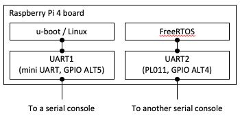

# raspi4_freertos

This repository includes a FreeRTOS UART sample application which can run on Raspberry Pi 4B.

## 1. Overview

This FreeRTOS porting uses UART2(PL011). The sample application is designed to be launched by u-boot and to operate together with 64-bit Linux.

This implementation is based on another FreeRTOS porting for Raspberry Pi 3 by eggman [1] (many thanks to him!).  

The sample application runs on the CPU core #3 on your Raspberry Pi 4B board. A specified memory region (0x20000000 - 0x207FFFFF) is dedicated to this application. Modify `FreeRTOS/Demo/CORTEX_A72_64-bit_Raspberrypi4/uart/src/raspberrypi4.ld` if you want to change the memory usage.

ARMv8-A MMU is available with VA = PA configuration. The current implementation employs 2-level address translation (1GB-page for the 1st level, 2MB-page for the 2nd level). See `FreeRTOS/Demo/CORTEX_A72_64-bit_Raspberrypi4/uart/src/mmu.c` for the detail.

[1] https://github.com/eggman/FreeRTOS-raspi3

## 2. Prerequisites

#### Linux installation

Install 64-bit Ubuntu or Debian on your Raspberry Pi 4B.
https://ubuntu.com/download/raspberry-pi
https://wiki.debian.org/RaspberryPi4

#### UART configuration



This figure illustrates an expected UART configuration. You need to prepare for two different serial consoles for each UART port dedicated to u-boot/Linux or FreeRTOS.

UART1(mini UART) for u-boot must be configured to use the GPIO ALT5 setting. Add `enable_uart=1` to `config.txt`. See https://www.raspberrypi.org/documentation/configuration/uart.md for the detail.

UART2(PL011) for FreeRTOS is  automatically configured to use the GPIO ALT4 setting in the FreeRTOS UART application. So you do not need to configure the UART port manually.

#### Compiler installation

You need to install a GCC toolset for aarch64, and can get it from [2]. Don't forget to add its binary path to $PATH. This should be done on your Raspi4 Linux environment.

I used AArch64 ELF bare-metal target (aarch64-none-elf) version 14.2.1 for this repository.

[2] https://developer.arm.com/tools-and-software/open-source-software/developer-tools/gnu-toolchain/gnu-a/downloads

#### u-boot compilation

A pre-built u-boot image provided by Ubuntu or Debian may not have the `dcache` command on the u-boot prompt. You need compile and install u-boot having cache management commands if u-boot provided by your Linux distribution does not have them.

(1) Source code download  

`$ git clone https://github.com/u-boot/u-boot`  

(2) Compilation

```
$ cd u-boot
$ export CROSS_COMPILE=aarch64-none-elf-
$ echo 'CONFIG_CMD_CACHE=y' >> ./configs/rpi_4_defconfig
$ make rpi_4_defconfig
$ make -j4 (if your PC has 4 processor cores)
```

(`CROSS_COMPILE` must be changed depending on a compiler you installed)

(3) Copy the binary to your SD card  

```
$ sudo cp ./u-boot.bin /path/to/sd_boot_partition/kernel8.img
```

(The new file name must be `kernel8.img`)

## 3. FreeRTOS UART sample build

Very simple! Just execute the following commands.

```
$ cd Demo/CORTEX_A72_64-bit_Raspberrypi4/uart
$ make CROSS=aarch64-none-elf-
```

(`CROSS` must be changed depending on a compiler you installed)

MMU is enabled by default. You can easily disable it by removing or commenting out the configure_mmu() call.

```
(in FreeRTOS/Demo/CORTEX_A72_64-bit_Raspberrypi4/uart/src/startup.S)
...
start_el1:
    ...
    // configure MMU
    // ldr   x0, =configure_mmu
    // blr   x0
    ...
```

If you want to change the memory location, you need to modify several things before compiling:

i) the linker script file `raspberrypi4.ld`,

```
(in FreeRTOS/Demo/CORTEX_A72_64-bit_Raspberrypi4/uart/src/raspberrypi4.ld)
...
CODE_BASE   = 0x20000000;
CODE_SIZE   = 0x00200000;
DATA_BASE   = CODE_BASE + CODE_SIZE;
DATA_SIZE   = 0x00400000;
STACK_TOP   = DATA_BASE + DATA_SIZE; /* STACK in the upper end of DATA */
PT_BASE     = DATA_BASE + DATA_SIZE;
PT_SIZE     = 0x00200000;
...
```

ii) the page table configuration and

```
(in FreeRTOS/Demo/CORTEX_A72_64-bit_Raspberrypi4/uart/src/mmu_cfg.c)

/* Page table configuration array */
#define NUM_PT_CONFIGS (5)
static struct ptc_t pt_config[NUM_PT_CONFIGS] =
{
    { /* Code region (Read only) */
        .addr = 0x20000000ULL,
        .size = SIZE_2M,
        .executable = XN_OFF,
        .sharable = NON_SHARABLE,
        .permission = READ_WRITE,
        .policy = TYPE_MEM_CACHE_WB,
    },
    { /* Data region */
        .addr = 0x20200000ULL,
        .size = SIZE_4M,
        .executable = XN_ON,
        .sharable = INNER_SHARABLE,
        .permission = READ_WRITE,
        .policy = TYPE_MEM_CACHE_WB,
    },
    ...
}
```

iii) the device tree overlay file `raspi4-rpmsg.dtso` too!

```
(in dts/raspi4-rpmsg.dtso)

    fragment@0 {
        target-path="/reserved-memory";
        __overlay__ {
            rtos@20000000 {
                compatible = "shared-dma-pool";
                no-map;
                reg = <0x0 0x20000000 0xA00000>;
            };
        };
    };

    fragment@1 {
        target-path="/";
        __overlay__ {
            shm@20600000 {
                compatible = "generic-uio";
                status = "okay";
                reg = <0x0 0x20600000 0x200000>;
            };
```

<u>If you also use another device tree overlay file for Raspberry Pi 4B (e.g. `vc4-kms-v3d`), the memory configuration of it may conflict with that of this sample. You will have to fix any conflict if you find it in `dmesg` output.</u>

## 4. Launching FreeRTOS by u-boot

(1) Copy the obtained binary to your SD card
```
$ sudo ./uart.elf /path/to/sd_boot_partition/
```

(2) Get the u-boot command on your Raspberry Pi 4B board  
Insert your SD card into your board, then power it on.

(3) Launch the FreeRTOS sample program on the u-boot prompt
```
setenv autostart yes
dcache off
ext4load mmc 0:2 0x28000000 /path/to/uart.elf
dcache flush
bootelf 0x28000000
```

`mmc 0:2` in the `ext4load` command execution will vary depending on your SD card configuration. Don't forget to use the `fatload` command if you copied the sample program binary to a FAT partition.

You will see output by the UART sample program.
```
****************************

    FreeRTOS UART Sample

  (This sample uses UART2)

****************************

00000FF8
...
```

## 5. Launching FreeRTOS and Linux

This is little bit complicated. Follow the procedure below.

#### Device tree overlay for FreeRTOS

You have to build a device tree overlay binary file for FreeRTOS. This process should be done on your Raspi4 Ubuntu(Debian) environement.

```
# Install the dtc command, a device tree compiler
$ sudo apt-get install device-tree-compiler

# Build a device tree overlay binary file and copy it under /boot/firmware/overlays
$ cd ./dts
$ dtc -O dtb -I dts ./raspi4-rpmsg.dtso -o ./raspi4-rpmsg.dtbo 
$ sudo cp ./raspi4-rpmsg.dtbo /boot/firmware/overlays/

# Add overlay configuration "dtoverlay=raspi4-rpmsg" to the [all] section in config.txt
$ cat /boot/firmware/config.txt
...
...

[all]
arm_64bit=1
...
...
dtoverlay=raspi4-rpmsg
```

#### Sample program compilation  
You need to add a macro `-D__LINUX__` to `CFLAGS` in Makefile. This macro adds a special function to avoid GIC configuration change by Linux.

```
$ cd Demo/CORTEX_A72_64-bit_Raspberrypi4/uart/
$ grep ^CFLAGS Makefile
CFLAGS = -mcpu=cortex-a72 -fpic -ffreestanding -std=gnu99 -O2 -Wall -Wextra -I$(INCLUDEPATH1) -I$(INCLUDEPATH2) -I$(INCLUDEPATH3) -DGUEST -D__LINUX__
$ make CROSS=aarch64-none-elf-
```
(`CROSS` must be changed depending on a compiler you installed)

#### Copy the obtained binary to your SD card  

Same as 4-(1) above.

#### Linux kernel parameter change

Add `maxcpus=3` to `cmdline.txt`. This enables Linux to use only CPU cores #0-2. The CPU core #3 can be used by FreeRTOS safely.

#### Launching FreeRTOS
Same as 4-(3). Execute the following commands on the u-boot prompt.
```
setenv autostart yes
dcache off
ext4load mmc 0:2 0x30000000 /path/to/uart.elf
dcache flush
bootelf 0x30000000
dcache on
```
But you will see only a message
```
Waiting until Linux starts booting up ...
```
on UART2(PL011) until you launch Linux.

#### Launching Linux

Quite simple. Just execute
```
run bootcmd
```
on the u-boot prompt. You will see Linux boot process output on UART1(mini UART) and FreeRTOS UART output on UART2(PL011).

## 6. Debugging

#### On your Raspberry Pi 4B board

(1) Boot Linux, then add `enable_jtag_gpio=1` to `/boot/firmware/config.txt`. After that, shutdown Linux.

(2) Connect your debugger probe and Raspberry Pi 4B board. (See https://sysprogs.com/VisualKernel/tutorials/raspberry/jtagsetup/ for details)

(3) Power your board on. Then stop the boot process at the u-boot prompt like the following.

```
(u-boot console log)
 ...
Hit any key to stop autoboot:  3
U-Boot>
```

#### On your PC for program compilation

Rebuild a target program (uart.elf) with the debug option `-g` to add debug symbols.

#### On your PC for remote debugging

(1) Compile and install the latest OpenOCD (http://openocd.org/repos/).

(2) Start the OpenOCD process.
```
$ sudo openocd -f /path/to/your_debugger.cfg -f /path/to/rpi4b.cfg
```

`your_debugger.cfg` varies depending on a debugger you use. It can be found in `tcl/interface/` included in the OpenOCD source directory.

`rpi4b.cfg` can be found in `tcl/board/` included in the OpenOCD source directory.

(3) Connect to OpenOCD by gdb.
```
$ aarch64-none-elf-gdb /path/to/uart.elf

(on gdb console)
target extended-remote :3336
load
```
(`aarch64-none-elf-` must be changed depending on a compiler you installed)

You are now ready to start debugging FreeRTOS running on Cortex-A72 core#3. You can add the source code path on the gdb console.

## 7. License

MIT License derived from FreeRTOS. See `LICENSE.md` for the detail.
```
./FreeRTOS/Demo/CORTEX_A72_64-bit_Raspberrypi4/uart/
./FreeRTOS/Source/
```

GPL-2.0 derived from u-boot(https://github.com/u-boot/u-boot). See individual files for the detail.
```
./FreeRTOS/Demo/CORTEX_A72_64-bit_Raspberrypi4/cache/
```

GPL-2.0 derived from Linux(https://github.com/raspberrypi/linux).
```
./dts/
```

